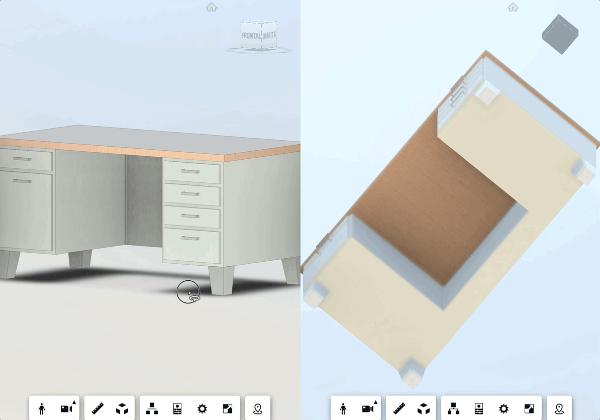
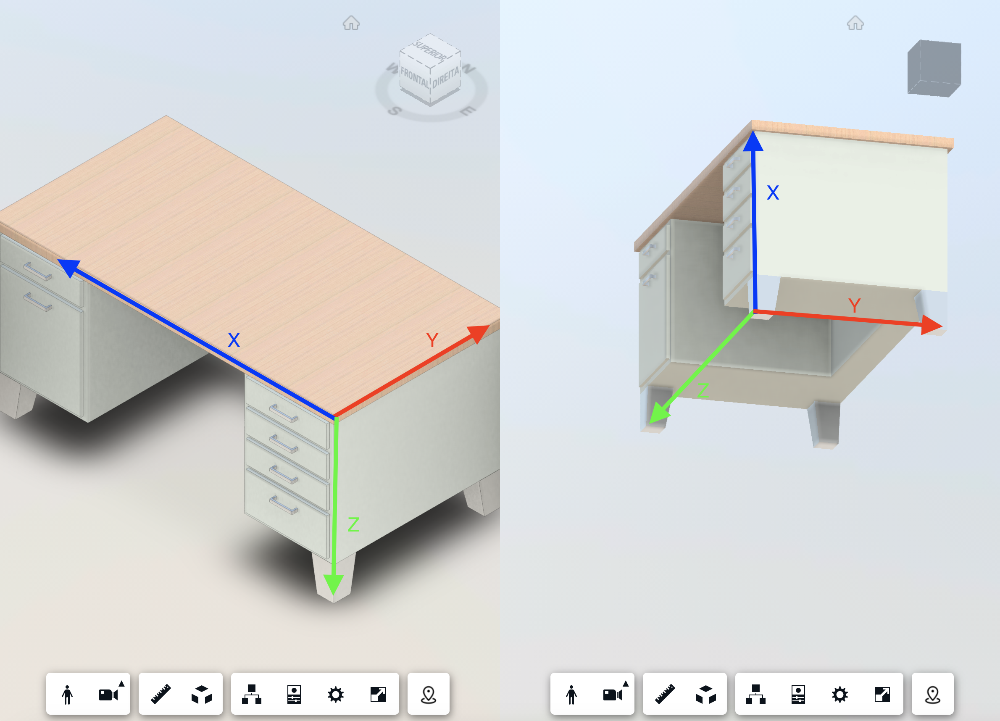

# viewer-sync
Simple repo to compare two designs side by side with proper sync

## Introduction
This sample demonstrates a way to syncronize two Viewers rendering the same project, but originated from diferent sources. It can be useful for a side by side comparision between a nwd, rvt, 3ds max design or a mesh, for instance.

## Premises
As our base assumption for this sample, we're going to assume that the models are compatible, i.e they refer to the same scene, differing in scale and/or rotation.

Our challenge will be on finding a way to syncronize the camera between the compatible scenes. Lets suppose we have two scenes rendering a table: If the tables are compatible, they both share the same proportions (length, width and heigth) in a way that we can define an equivalence of coordinates from them.

## How to find the equivalence?
When we move from one scene to the other, there are a few transformations that we need to consider.

First of them is rotation, as the tables can be misaligned:



The other transformation that we need to consider is regarding scale:


Lastly, we also need to consider the different origins for the coordinates systems of those scenes.

With a combination of all these conversions (rotation, scale and translation) we can syncronize the two scenes.

## The math behind the sync
Before jumping into the math for our calculations, lets begin with some contextuakization.

Both scenes represent each a [vector space](https://en.wikipedia.org/wiki/Vector_space), with its own coordinate system.



Each space will have its own [basis](https://en.wikipedia.org/wiki/Basis_(linear_algebra)), that we'll use to find the proper transformations. So first of all, we need to find those.

### - Finding the basis
Each Viewer scene itself has its own coordinate system with basis defined, but we can't simply use those, as they don't "see" the model the same way.

If we have two basis representing the models in the scene with the same relative orientation, we can defina a transformation between those. This transformation will be useful to convert coordinates between these two spaces.

To find these basis, we can query the user to pick 4 points (in each scene).

These points need to be compatible between both scenes, and can'b be [coplanar](https://en.wikipedia.org/wiki/Coplanarity)
Let's use an example:

- 1st point = front end of the table base, below the 4 drawers
- 2nd point = front end of the table base, below the 2 drawers
- 3rd point = front end of the table top, above the 2 drawers
- 4th point = rear end of the table top, above the 2 drawers


From these points, we can define our base with the snippet below:

```js
let v12 = this.points[1].clone().sub(this.points[0]);
let v13 = this.points[2].clone().sub(this.points[0]);
this.basis1 = this.points[1].clone().sub(this.points[0]);

let line12 = new THREE.Line3(this.points[0], this.points[1]);
let plane123 = (new THREE.Plane()).setFromCoplanarPoints(this.points[0], this.points[1], this.points[2]);
let auxPoint = line12.closestPointToPoint(this.points[2], false);
this.basis2 = this.points[2].clone().sub(auxPoint);

let auxDistance = plane123.distanceToPoint(this.points[3]);
let auxVector = v12.cross(v13);
this.basis3 = auxVector.normalize().multiplyScalar(auxDistance);

let auxbaseMatrix = new THREE.Matrix4();
this.baseOrigin = this.points[0].clone();

this.obliqueVector = this.basis1.clone().add(this.basis2.clone()).add(this.basis3.clone());

this.spaceBaseNormal = auxbaseMatrix.clone().makeBasis(this.basis1.clone().normalize(), this.basis2.clone().normalize(), this.basis3.clone().normalize());
```

First vector of our base will be the vector from point 1 to point 2


Second vector of our base will be the height of the triangle formed by points 1, 2 and 3 (taking as base the line passing by points 1 and 2)


Third vector will be perpendicular to the previous bases and its module will be the distance between the plane 123 and point 4.


And that's it!
Our space base will be formed by these normalized vectors, and it'll help us to take care of the rotation between the two scenes.

We also defined an oblique vector (suming the three basis vectors without normalization) that we'll use to take care of the scaling.

These two spaces basis origins will help us figuring out the translation between coordinates.

### - Handling rotation
The transformation between the two spaces basis can be found using the snippet below:

```js
function findRotation(targetViewerBase, originViewerBase) {
    return (new THREE.Matrix4()).multiplyMatrices(targetViewerBase, originViewerBase.transpose());
}
```

In our case, we'll use the base created with the normalized vectors, so it returns a matrix the we'll use to transform any vector orientation from originViewerBase to originViewerBase.

### - Handling scale
For scaling, we are going to assume that we have the same scale factor for all the axis (x, y, and z). If we apply different scale factor, that would mean that we have a distortion among the scenes (i.e. the proportions were'nt respected in one specific scene).
The scale can be found using the function below:
```js
function findScale(targetViewerVector, originViewerVector) {
    return (new THREE.Matrix4()).makeScale(targetViewerVector.length() / originViewerVector.length(), targetViewerVector.length() / originViewerVector.length(), targetViewerVector.length() / originViewerVector.length());
}
```
In our case, we'll use the oblique vector ratio (targetViewerVector divided by originViewerVector) to apply the scale.

### - Handling translation
Regarding translation, we have to consider the two basis origins.

For any point that we want to transform, we need to subtract the origin of its original base and sum the origin of the target base.

## Putting everything together
For any point conversion between scenes we need to follow the same order below:

 - Subtract the base origin of the origin scene
 - Apply the rotation transformation to the vector
 - Apply the scale transformation to the vector
 - Sum the base origin of the target scene

Just like in the following snippet:

```js
let targetViewerPoint = originViewerPoint.clone().sub(originBaseOrigin).applyMatrix4(rotationMatrix).applyMatrix4(scaleMatrix).add(targetBaseOrigin);
```
With all of that together, we can sync the two scenes like a charm.


Also note that for two specific models, this needs to be done **only in the first loading**. After the first calibration, you can store the required information such as matices and vectors in an external DB to be loaded every time the models are compared.